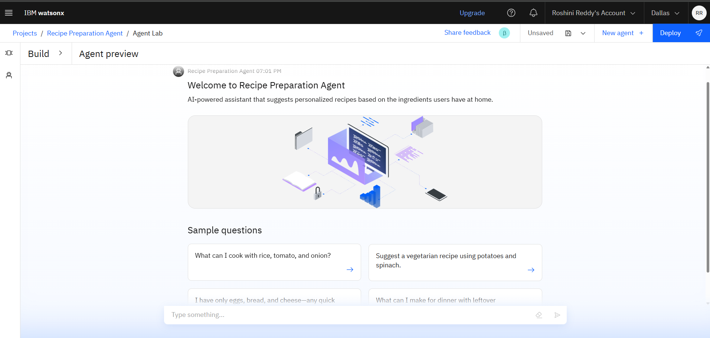
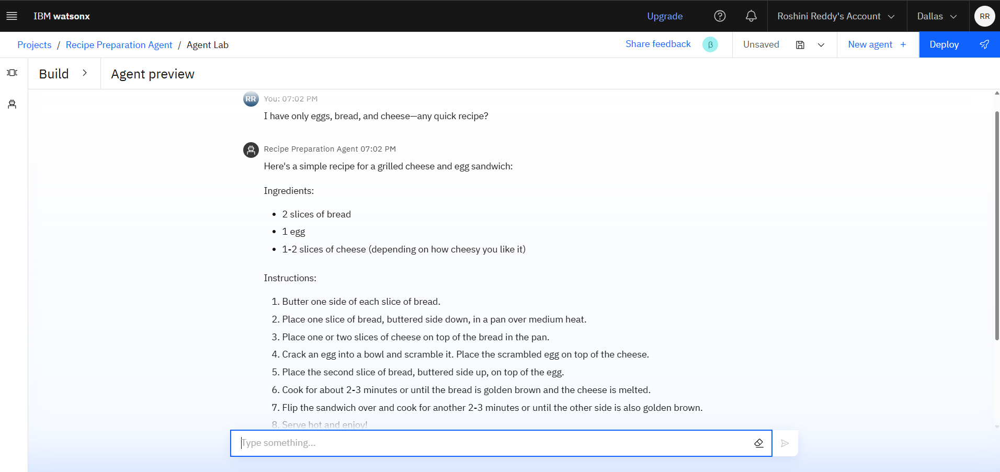
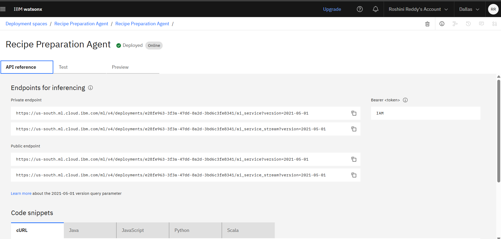
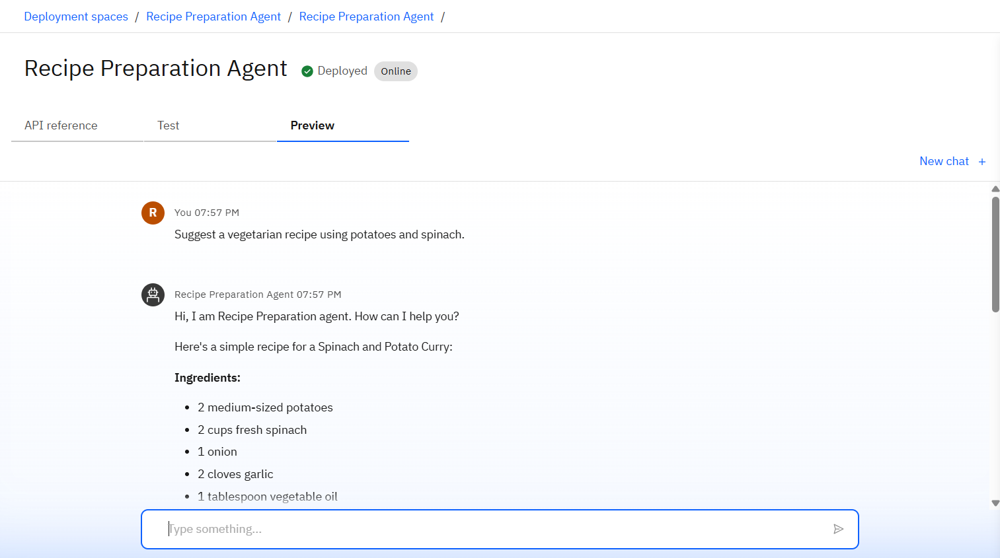

# 🍳Recipe Preparation AI Agent

**Recipe Preparation AI Agent** is an AI-powered assistant that helps users cook delicious meals using only the ingredients they already have at home. Built using **IBM Watsonx.ai** and **Retrieval-Augmented Generation (RAG)**, the agent suggests personalized recipes, step-by-step cooking instructions, and ingredient substitutions — making daily cooking smarter, easier, and more sustainable.

---

## 🧩 Problem Statement

Many people struggle to figure out what to cook with limited ingredients at home. Searching online often requires exact ingredients, wasting time and food. There's a need for a smart, context-aware cooking assistant that can turn what's available into practical meals.

---

## 💡 Proposed Solution

CookSmart uses IBM Watsonx.ai and a vector index to understand user-provided ingredients and recommend suitable recipes. The agent retrieves relevant recipes from a local database, generates instructions, suggests substitutions, and offers dietary guidance using generative AI.

---

## 🧠 Technologies Used

- IBM Watsonx.ai Studio
- IBM Granite Foundation Model (LLM)
- Vector Indexing with RAG
- Python (Flask)
- HTML (Form-based UI)
- JSON/Plain Text Recipe Dataset
- IBM Cloud Object Storage

---

## ☁️ IBM Cloud Services

- IBM Watsonx.ai
- IBM Granite LLM
- IBM Cloud Object Storage
- Watsonx Vector Index
- IBM Cloud Functions (optional)
- IBM Cloud IAM (authentication)
- IBM Cloud Lite account (Free tier)

---

## 👥 End Users

- Home cooks  
- Students in hostels/PGs  
- Beginners with minimal cooking experience  
- People with dietary restrictions  
- Families looking to reduce food waste

---

## 🌟 WOW Factors

- AI-driven cooking suggestions based on real-time ingredients
- RAG-based recipe retrieval from your own data
- Step-by-step instructions with substitutions
- Dietary filters and vegetarian/vegan options
- Cloud-native and deployable with Watsonx.ai
- Easily expandable with voice/image inputs or chatbot

---

## 🧪 Key Features

- Ingredient-based recipe search
- Step-by-step cooking instructions
- Ingredient substitutions (e.g., garlic → ginger)
- Simple HTML UI with Flask backend
- Multilingual or dietary customization (future scope)

---

## 🚀 How It Works

1. User enters ingredients: _“rice, onion, tomato”_
2. Agent processes the query using Watsonx.ai and RAG
3. Relevant recipe is retrieved from the dataset
4. Step-by-step instructions + substitutions are generated
5. Result is displayed in the browser

---

## 📸 Screenshots

### ✨📌▪️🔹🔷🔴 Home Page

### Testing

### API

### Deployment

---

## 💬 Sample Queries
- “What can I cook with rice, tomato, and onion?”  
- “Suggest a vegan meal using spinach and potato.”  
- “I only have eggs, garlic, and bread — help!”  
- “What can I make for dinner with leftover vegetables?”

---

## 🔮 Future Scope
- Add voice input and spoken instructions
- WhatsApp / Telegram chatbot interface
- Add nutrition calculator and meal planner
- Multilingual response support (e.g., Hindi, Tamil)
- Weekly meal prep & grocery assistant integration
- Scan groceries to generate recipe ideas

---

## 🔗 Useful Links

- [IBM Cloud Lite](https://cloud.ibm.com/registration)  
- [IBM Watsonx.ai](https://www.ibm.com/products/watsonx-ai)  
- [GitHub – IBM Developer Repos](https://github.com/IBM)  

---

👩‍💻 Created By
**Roshini E**
B.Tech in Computer Science and Engineering
Presidency University , Bangalore
